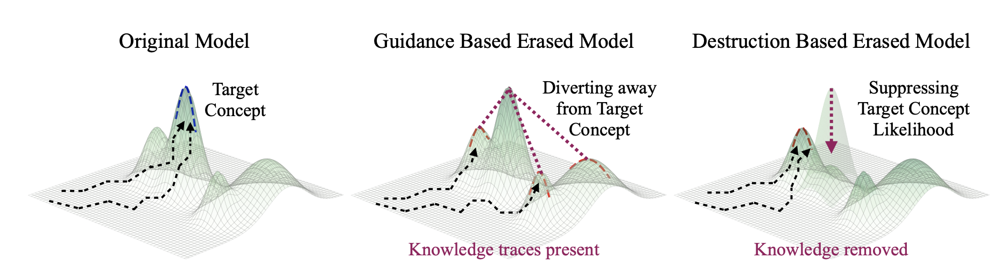

# When Are Concepts Erased From Diffusion Models?

[**Paper on arXiv**](https://arxiv.org/abs/2505.17013)

This repository provides the official implementation of **"When Are Concepts Erased From Diffusion Models?"** accepted at NeurIPS 2025.



## Environment Setup

Create and activate the provided Conda environment:

```bash
conda env create -f erasing_env.yaml
conda activate erasing_env
```

## Running the Demo

Navigate to the `src` directory and run the demo script:

```bash
cd src
python demo.py
```

This will:
1. Run all available probes on the configured model(s)
2. Save generated images under `data/results/`
3. Automatically compute evaluation metrics (CLIP similarity and classification accuracy)

## Available Probes

The demo runs the following probes to test concept erasure:

- **StandardPromptProbe**: Basic prompt-based image generation
- **NoiseBasedProbe**: Tests model robustness to trajectory perturbations
  - Runs with and without classifier guidance
- **DiffusionCompletionProbe**: Tests diffusion completion from partial images
- **InterferenceProbe**: Tests interference between concepts
- **InpaintingProbe**: Evaluates concept regeneration in masked regions
- **TextualInversionProbe**: Assesses embedding-level concept understanding

## Running Probes on Your Model

To run the probes on your own model:

```bash
cd src
python runner.py --concept <your_concept> --pipeline_path <path_to_your_model>
```

For example:
```bash
python runner.py --concept airliner --pipeline_path kevinlu4588/esd-x-airliner
```

This will run all probes by default. You can also specify individual probes:
```bash
python runner.py --concept airliner --pipeline_path <model_path> --probes standardpromptprobe noisebasedprobe
```

## 📖 Citation

If you find this work useful in your research, please consider citing:

```bibtex
@inproceedings{lu2025concepts,
  title={When Are Concepts Erased From Diffusion Models?},
  author={Kevin Lu, Nicky Kriplani, Rohit Gandikota, Minh Pham, David Bau, Chinmay Hegde, and Niv Cohen},
  booktitle={Advances in Neural Information Processing Systems (NeurIPS)},
  year={2025}
}
```

---

## 🔗 Related Work

Our work builds upon a growing body of research on concept erasure and targeted model editing, including  

- **[Erased Stable Diffusion (ESD)](https://arxiv.org/abs/2303.07326)** — model finetuning for concept removal  
- **[Universal Concept Editing (UCE)](https://arxiv.org/abs/2307.00756)** — lightweight cross attention projection
- **[TaskVectors](https://arxiv.org/abs/2302.00658)** — linear task steering in model weight space  
- **[STEREO](https://arxiv.org/abs/2402.04362)** — ESD + Textual Inversion loop
- **[RECE](https://arxiv.org/abs/2403.13862)** — UCE + additional embedding projection  
- **[UnlearnDiffAtk](https://arxiv.org/abs/2403.08598)** — adversarial prompt optimization

We thank the authors of these methods for laying the groundwork for this research.


---

## 📄 License

This project is licensed under the MIT License - see the [LICENSE](LICENSE) file for details.


## 📧 Contact

For questions about the code or paper, please open an issue or contact [lu.kev@northeastern.edu].

---